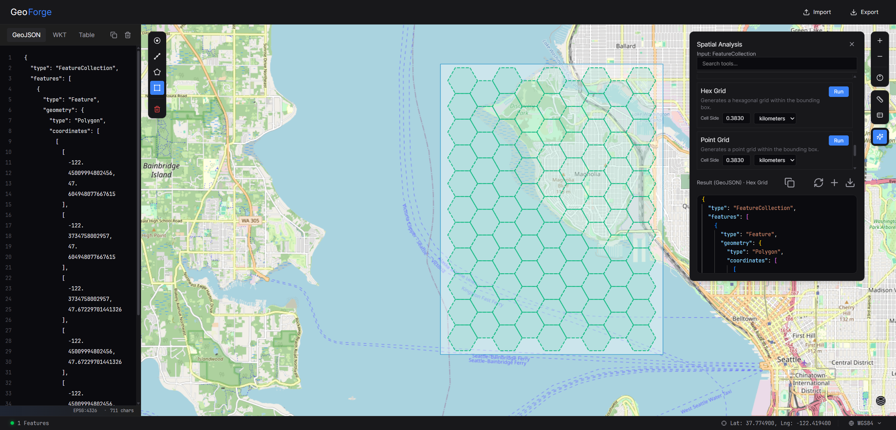

# GeoForge

<div align="center">

[](https://opensource.org/licenses/MIT)
[](https://nextjs.org/)
[](https://react.dev/)
[](https://www.typescriptlang.org/)
[](https://openlayers.org/)

**A modern, high-performance web application for creating, editing, analyzing, and visualizing geospatial data**

[**🌐 Try it Online**](https://www.geo-forge.org/) · [**📖 Documentation**](#features) · [**🐛 Report Bug**](https://github.com/zyfgisrs/GeoForge/issues) · [**💡 Request Feature**](https://github.com/zyfgisrs/GeoForge/issues)

[](https://github.com/zyfgisrs/GeoForge/stargazers)
[](https://github.com/zyfgisrs/GeoForge/network/members)
[](https://github.com/zyfgisrs/GeoForge/issues)



[English](#english) · [简体中文](#简体中文) · [繁體中文](#繁體中文) · [한국어](#한국어) · [日本語](#日本語) · [Français](#français) · [Español](#español) · [Русский](#русский) · [العربية](#العربية) · [हिन्दी](#हिन्दी) · [Português](#português) · [Deutsch](#deutsch)

</div>

---

## Table of Contents

- [About](#about)
- [Features](#features)
- [Tech Stack](#tech-stack)
- [Installation](#installation)
- [Usage](#usage)
- [Deployment](#deployment)
- [Roadmap](#roadmap)
- [Contributing](#contributing)
- [License](#license)
- [Acknowledgments](#acknowledgments)

---

## About

GeoForge (formerly GeoJSON Tool) is a modern, high-performance web application designed for creating, editing, analyzing, and visualizing geospatial data. Built with **Next.js 15**, **React**, and **OpenLayers**, it provides a seamless experience for working with GeoJSON, WKT, Shapefile, and other spatial formats.

### Key Highlights

- 🚀 **High Performance**: Optimized rendering and data processing for large datasets
- 🔍 **SEO Optimized**: Built with Next.js for better search engine visibility
- 🌍 **Multi-Language Support**: 12 languages including English, Chinese, Japanese, Korean, and more
- 🎨 **Modern UI**: Clean, professional interface built with shadcn/ui and Tailwind CSS
- 🔧 **Powerful Tools**: Advanced spatial analysis, editing, and visualization capabilities
- 💻 **Open Source**: Free and open-source under MIT license

---

## Features

### 🗺️ Map Visualization & Interactivity

- **Engine**: Powered by **OpenLayers** for robust map rendering
- **Base Maps**: Switch between multiple map styles
  - OpenStreetMap
  - CartoDB Light
  - CartoDB Dark
  - CartoDB Voyager
  - ArcGIS Topo
  - OpenTopoMap
  - Satellite imagery
- **Interactive Tools**:
  - **Navigation**: Smooth Zoom, Pan, and Rotate (Ctrl + Drag)
  - **Location Search**: Instantly find places and center map on them
  - **Map Snapshot**: Capture high-quality screenshots of your current map view
  - **Drawing Tools**: Create Points, LineStrings, Polygons, and Rectangles
  - **Editing**: Modify existing geometries, snap to vertices
  - **Measurement**: Interactive Distance (km/m) and Area (km²/m²) tools with geodesic calculations

### 📝 Dual-View Editor

- **Monaco Editor**: VS Code-like editor with syntax highlighting and IntelliSense
- **Supported Formats**:
  - **GeoJSON**: Full support with validation
  - **WKT** (Well-Known Text): View as single `GEOMETRYCOLLECTION` or individual elements
- **Table View**: Inspect and edit feature properties in a tabular format
- **Safety Features**: Large dataset protection (disables preview > 500KB to prevent browser freezing)
- **Coordinate Systems**: Real-time re-projection support for:
  - **EPSG:4326** (WGS84)
  - **EPSG:3857** (Web Mercator)
  - **EPSG:4269** (NAD83)
  - **EPSG:2154** (Lambert-93)

### ⚙️ Spatial Analysis

Built-in advanced geospatial analysis tools powered by **Turf.js**:

| Category                | Tools                                                           |
| ----------------------- | --------------------------------------------------------------- |
| **Basic Operations**    | Center, Bounding Box (BBox)                                     |
| **Geometry Operations** | Buffer, Polygon Smooth, Concave/Convex Hull, Simplify           |
| **Spatial Relations**   | Points Within Polygon, Union, Intersection, Difference          |
| **Grid Generation**     | Hex Grid, Point Grid, Square Grid                               |
| **Voronoi Diagram**     | Create Voronoi polygons from input points                       |
| **Measurement**         | Calculate Area (m²/km²) and Length (m/km) as feature properties |

All analysis results are immediately visualized on the map and provided as downloadable GeoJSON.

### 🔄 Import & Export

- **Import Formats**:
  - GeoJSON (`.json`, `.geojson`)
  - Shapefile (`.zip` archive with `.shp`, `.shx`, `.dbf`)
  - WKT (`.wkt`, `.txt`)
- **Export Formats**:
  - GeoJSON
  - Shapefile (Zipped)
  - WKT
  - KML

### 🌐 Internationalization

GeoForge supports **12 languages**:

- 🇨🇳 简体中文 (Simplified Chinese)
- 🇹🇼 繁體中文 (Traditional Chinese)
- 🇺🇸 English
- 🇰🇷 한국어 (Korean)
- 🇯🇵 日本語 (Japanese)
- 🇫🇷 Français (French)
- 🇪🇸 Español (Spanish)
- 🇷🇺 Русский (Russian)
- 🇸🇦 العربية (Arabic)
- 🇮🇳 हिन्दी (Hindi)
- 🇧🇷 Português (Portuguese)
- 🇩🇪 Deutsch (German)

### 🎨 Modern UI

- **Dark Mode**: Sleek, professional dark interface optimized for long sessions
- **Responsive Layout**: Flexible panels for simultaneous map and code viewing
- **Accessibility**: Built with accessibility best practices
- **Components**: Built with **shadcn/ui** and **Tailwind CSS**

---

## Tech Stack

| Category                 | Technology                                                                        |
| ------------------------ | --------------------------------------------------------------------------------- |
| **Framework**            | [Next.js](https://nextjs.org/) 15.5 (App Router)                                  |
| **Frontend**             | [React](https://react.dev/) 18.3.1                                                |
| **Language**             | [TypeScript](https://www.typescriptlang.org/) 5.5                                 |
| **Map Engine**           | [OpenLayers](https://openlayers.org/) 10.7                                        |
| **Geospatial Analysis**  | [Turf.js](https://turfjs.org/) 7.3                                                |
| **Code Editor**          | [Monaco Editor](https://microsoft.github.io/monaco-editor/)                       |
| **Internationalization** | [i18next](https://www.i18next.com/) + [react-i18next](https://react.i18next.com/) |
| **Styling**              | [Tailwind CSS](https://tailwindcss.com/) 4.x                                      |
| **UI Components**        | [shadcn/ui](https://ui.shadcn.com/)                                               |
| **State Management**     | [Zustand](https://github.com/pmndrs/zustand)                                      |
| **Icons**                | [Lucide React](https://lucide.dev/)                                               |

---

## Installation

### Prerequisites

- **Node.js** v18 or higher recommended
- **npm** or **yarn** or **pnpm** package manager

### Quick Start

1. **Clone the repository**

```bash
git clone https://github.com/zyfgisrs/GeoForge.git
cd GeoForge
```

2. **Install dependencies**

```bash
npm install
```

3. **Start the development server**

```bash
npm run dev
```

4. **Open your browser**

Visit `http://localhost:3000` (or the port shown in your terminal)

### Build for Production

Build the application for deployment:

```bash
npm run build
```

The optimized build output will be in the `.next` directory.

### Start Production Server

Start the production server locally:

```bash
npm start
```

---

## Deployment

### Vercel (Recommended)

The easiest way to deploy GeoForge is to use [Vercel](https://vercel.com):

[](https://vercel.com/new/clone?repository-url=https://github.com/zyfgisrs/GeoForge)

### Self-Hosted

For self-hosted deployments:

```bash
# Build the application
npm run build

# Start with Node.js
npm start

# Or use PM2 for process management
pm2 start npm --name "geoforge" -- start
```

### Docker

```dockerfile
FROM node:18-alpine AS builder
WORKDIR /app
COPY package*.json ./
RUN npm ci
COPY . .
RUN npm run build

FROM node:18-alpine AS runner
WORKDIR /app
COPY --from=builder /app/.next/standalone ./
COPY --from=builder /app/.next/static ./.next/static
COPY --from=builder /app/public ./public

EXPOSE 3000
CMD ["node", "server.js"]
```

---

## Usage

### Basic Workflow

1. **Import Data**

   - Click the **Import** button in the header
   - Select your GeoJSON, Shapefile (ZIP), or WKT file
   - Choose to replace or append existing data

2. **Edit Geometry**

   - Use drawing tools on the map to create new features
   - Select existing features to edit their geometry
   - Modify properties in the Table view

3. **Analyze Data**

   - Open the Analysis panel
   - Select a tool (e.g., Buffer, Union, Intersect)
   - Configure parameters and run the analysis
   - View results on the map and in the editor

4. **Export Results**
   - Click the **Export** button
   - Choose your preferred format
   - Download the processed data

### Tips

- ⌨️ Press **Esc** to exit drawing mode or deselect features
- 🖱️ **Double-click** on features to edit their properties
- 🔍 Use **Ctrl + Drag** to rotate the map
- 📏 Enable measurement tools to calculate distances and areas interactively
- 💾 Large files (> 500KB) will disable code preview for performance

---

## Roadmap

### Current Focus (Q1 2026)

- [ ] Add layer management with visibility toggles
- [ ] Implement attribute table sorting and filtering
- [ ] Add more coordinate system projections
- [ ] Improve mobile responsiveness

### Future Plans

- [ ] Support for additional formats (GeoPackage, TopoJSON)
- [ ] Advanced styling rules and style templates
- [ ] Collaborative editing features
- [ ] Plugin system for custom analysis tools
- [ ] Desktop application (Electron)

---

## Contributing

Contributions are welcome! 🎉

### How to Contribute

1. **Fork the repository**
2. **Create a feature branch** (`git checkout -b feature/amazing-feature`)
3. **Make your changes**
4. **Commit your changes** (`git commit -m 'Add some amazing feature'`)
5. **Push to the branch** (`git push origin feature/amazing-feature`)
6. **Open a Pull Request**

### Development Guidelines

- Follow the existing code style and conventions
- Write meaningful commit messages
- Add tests for new features
- Update documentation as needed
- Ensure all linters pass before submitting

### Reporting Issues

When reporting bugs, please include:

- Clear description of the issue
- Steps to reproduce
- Expected vs actual behavior
- Screenshots if applicable
- Browser and version information

---

## License

This project is licensed under the MIT License - see the [LICENSE](LICENSE) file for details.

---

## Acknowledgments

- **Next.js** team for the excellent React framework
- **OpenLayers** team for the powerful mapping library
- **Turf.js** for advanced geospatial analysis tools
- **Monaco Editor** team for the outstanding code editor
- **shadcn/ui** for beautiful and accessible UI components
- All contributors who helped make GeoForge better

---

<div align="center">

**Made with ❤️ by the GeoForge Team**

[⬆ Back to Top](#geoforge)

</div>

---

## 简体中文

GeoForge（原 GeoJSON Tool）是一个现代化、高性能的 Web 应用程序，用于创建、编辑、分析和可视化地理空间数据。基于 **Next.js 15**、React 和 OpenLayers 构建，为处理 GeoJSON、WKT 和其他空间格式提供了无缝体验。

## 繁體中文

GeoForge（前身為 GeoJSON Tool）是一個現代化、高效能的網頁應用程式，用於建立、編輯、分析和視覺化地理空間資料。使用 **Next.js 15**、React 和 OpenLayers 建構，為處理 GeoJSON、WKT 和其他空間格式提供無縫體驗。

## 한국어

GeoForge (이전 GeoJSON Tool)는 지리 공간 데이터를 생성, 편집, 분석 및 시각화하기 위한 최신형 고성능 웹 애플리케이션입니다. **Next.js 15**, React와 OpenLayers를 기반으로 구축되었으며, GeoJSON, WKT 및 기타 공간 형식 작업을 위한 원활한 경험을 제공합니다.

## 日本語

GeoForge（旧 GeoJSON Tool）は、地理空間データの作成、編集、分析、可視化のための最新かつ高性能な Web アプリケーションです。**Next.js 15**、React と OpenLayers で構築されており、GeoJSON、WKT、その他の空間フォーマットでの作業にシームレスな体験を提供します。

## Français

GeoForge (anciennement GeoJSON Tool) est une application web moderne et haute performance pour créer, éditer, analyser et visualiser des données géospatiales. Construit avec **Next.js 15**, React et OpenLayers, il offre une expérience fluide pour travailler avec GeoJSON, WKT et d'autres formats spatiaux.

## Español

GeoForge (anteriormente GeoJSON Tool) es una aplicación web moderna y de alto rendimiento para crear, editar, analizar y visualizar datos geoespaciales. Construido con **Next.js 15**, React y OpenLayers, proporciona una experiencia perfecta para trabajar con GeoJSON, WKT y otros formatos espaciales.

## Русский

GeoForge (ранее GeoJSON Tool) - это современное высокопроизводительное веб-приложение для создания, редактирования, анализа и визуализации геопространственных данных. Созданный на базе **Next.js 15**, React и OpenLayers, он обеспечивает бесперебойную работу с GeoJSON, WKT и другими пространственными форматами.

## العربية

GeoForge (سابقاً GeoJSON Tool) هو تطبيق ويب حديث وعالي الأداء لإنشاء وتحرير وتحليل وتصور البيانات الجغرافية المكانية. مبني باستخدام **Next.js 15** و React و OpenLayers، فهو يوفر تجربة سلسة للعمل مع GeoJSON و WKT وغيرها من التنسيقات المكانية.

## हिन्दी

GeoForge (पूर्व में GeoJSON Tool) भौगोलिक स्थानिक डेटा बनाने, संपादित करने, विश्लेषण करने और विज़ुअलाइज़ करने के लिए एक आधुनिक, उच्च प्रदर्शन वेब एप्लिकेशन है। **Next.js 15**, React और OpenLayers के साथ निर्मित, यह GeoJSON, WKT और अन्य स्थानिक प्रारूपों के साथ काम करने के लिए एक सहज अनुभव प्रदान करता है।

## Português

GeoForge (anteriormente GeoJSON Tool) é um aplicativo web moderno e de alto desempenho para criar, editar, analisar e visualizar dados geoespaciais. Construído com **Next.js 15**, React e OpenLayers, oferece uma experiência perfeita para trabalhar com GeoJSON, WKT e outros formatos espaciais.

## Deutsch

GeoForge (ehemals GeoJSON Tool) ist eine moderne, leistungsstarke Webanwendung zum Erstellen, Bearbeiten, Analysieren und Visualisieren von Geodaten. Mit **Next.js 15**, React und OpenLayers erstellt, bietet es ein nahtloses Erlebnis für die Arbeit mit GeoJSON, WKT und anderen räumlichen Formaten.
